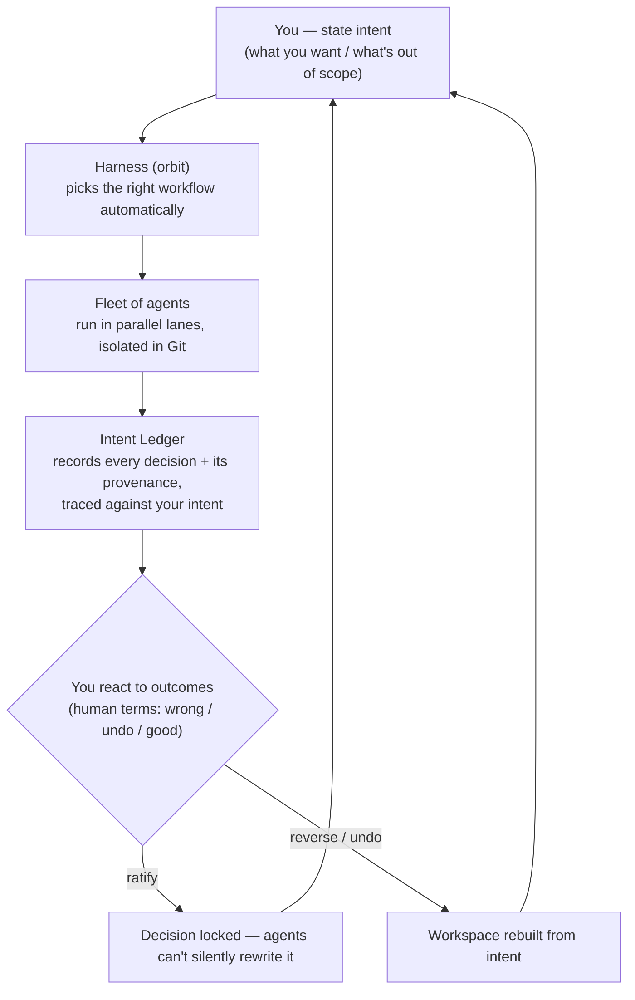

# Overview & mental model

> Status: Core ideas · Target version 0.1.x

## What you'll learn

The handful of pieces that make up Planetz, and — more importantly — how they fit into a single loop. Once you have this mental model, every screen in the product is just a window onto one of these parts.

---

## One loop, five parts

Planetz is not a chat box. It's a loop you run a *fleet* of agents through, with your intent held safely outside the blast radius.

The five parts:

1. **Tasks & the fleet.** You queue real work as tasks and run a squad of agents in parallel lanes — directing, not typing every line. → [Multi-agent fleet](multi-agent.md)
2. **The harness (orbit).** Each task runs on a governed workflow, and Planetz routes it to the right one automatically. → [The harness](harness-governance.md)
3. **The Intent Ledger.** Every decision a run makes is recorded with its *provenance* and traced against what you decided. Drift becomes visible. → [The Intent Ledger](intent-ledger.md)
4. **Disposable Git workspaces.** Runs are isolated, diffable, and recoverable; code is treated as a regenerable derivative of intent. → [Git integration](git-integration.md)
5. **Where it runs.** Inference can stay on your machine via edge models, and scale to Cloud when you need it. → [Edge AI & data sovereignty](edge-ai.md)

## The one idea behind all of it

Most tools protect the *running code* and ask you to approve every step. Planetz flips both:

> **Protect the _intent_, not the code.** Keep your intent as the durable, protected asset — outside the workspace — and let the code be cheap to destroy and rebuild. Then you don't pre-approve work; you **react to outcomes** after they happen, and lock the decisions you agree with so no future run can quietly undo them.

This is why the same object — the [Intent Ledger](intent-ledger.md) — is both the thing that **kills drift** and the thing that lets **non-experts** keep an AI-built system on-spec. Everything else in Planetz exists to feed and serve that loop.

## How the screens map to the parts

| You want to… | Go to | Underlying part |
|---|---|---|
| Queue and watch work | Task deck | Tasks & fleet |
| Shape an idea before running it | Conversation | Tasks |
| Author and trace intent | Spec Studio | Intent Ledger |
| Review what agents decided | Decisions | Intent Ledger |
| See/define the process | Workflows | Harness |
| Follow a run | Logs & summary | Harness + fleet |
| Choose models, edge, integrations | Settings | Edge AI + harness |

## Next

- [The Intent Ledger](intent-ledger.md) — start here; it's the core innovation.
- [The harness: govern, don't pre-approve](harness-governance.md) — how runs are kept safe without rubber-stamping.
