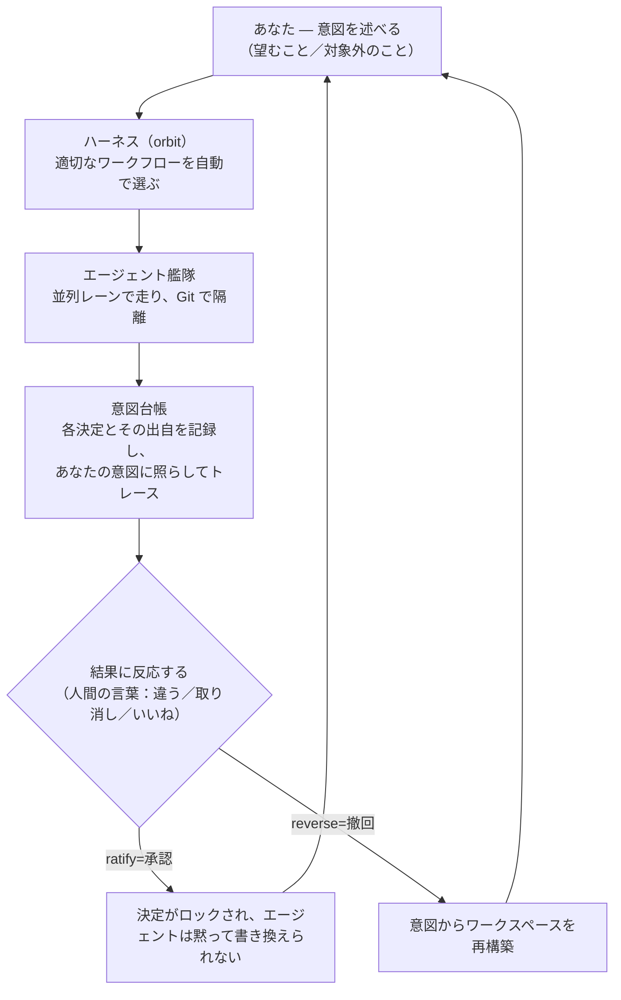

# 全体像とメンタルモデル

> Status: 中核となる考え方 · 対象バージョン 0.1.x

## このページでわかること

Planetz を構成するわずかな要素と、それ以上に重要な「それらがどう 1 つのループに噛み合うか」。このメンタルモデルさえ掴めば、製品の各画面は、このループのどこかを覗く窓に過ぎないと分かります。

---

## 1 つのループ、5 つの要素

Planetz はチャットボックスではありません。あなたの意図を爆心地の外に安全に置いたまま、エージェントの*艦隊*を通すループです。

5 つの要素：

1. **タスクと艦隊。** 実作業をタスクとして投入し、エージェントの一団を並列レーンで走らせる——1 行ずつ書くのではなく、指揮する。→ [マルチエージェント艦隊](multi-agent.md)
2. **ハーネス（orbit）。** 各タスクは統治されたワークフローの上で走り、Planetz が適切なものへ自動でルーティングする。→ [ハーネス](harness-governance.md)
3. **意図台帳。** 実行中の各決定を*出自*つきで記録し、あなたが決めたことに照らしてトレースする。ドリフトが可視化される。→ [意図台帳](intent-ledger.md)
4. **使い捨ての Git ワークスペース。** 実行は隔離・差分可能・復元可能で、コードは意図から再生成できる派生物として扱われる。→ [Git 連携](git-integration.md)
5. **どこで走るか。** 推論はエッジモデルで手元のマシンに留められ、必要なときに Cloud へスケールする。→ [エッジ AI とデータ主権](edge-ai.md)

## すべての背後にある 1 つの考え

多くのツールは*走っているコード*を守り、全ステップの承認を求めます。Planetz はその両方を反転させます。

> **コードではなく*意図*を守る。** あなたの意図を、ワークスペースの外にある永続的で保護された資産とし、コードは壊して作り直せる安いものにする。すると作業を事前承認するのではなく、起きた後の**結果に反応**し、同意した決定をロックして、将来のどの実行も黙って覆せないようにできる。

だからこそ同じ対象——[意図台帳](intent-ledger.md)——が、**ドリフトを殺すもの**であると同時に、**非エキスパート**が AI 製システムを仕様どおりに保つことを可能にするものなのです。Planetz の他のすべては、このループを養い、支えるために存在します。

## 画面と要素の対応

| やりたいこと | 行く画面 | 背後の要素 |
|---|---|---|
| 作業を投入して見る | タスク Deck | タスクと艦隊 |
| 走らせる前に着想を練る | 会話モード | タスク |
| 意図を書きトレースする | Spec Studio | 意図台帳 |
| エージェントの決定をレビュー | Decisions | 意図台帳 |
| プロセスを見る／定義する | ワークフロー | ハーネス |
| 実行を追う | ログとサマリー | ハーネス＋艦隊 |
| モデル・エッジ・連携を選ぶ | 設定 | エッジ AI＋ハーネス |

## 次に読む

- [意図台帳](intent-ledger.md) — まずここから。中核の革新です。
- [ハーネス：事前承認しない統治](harness-governance.md) — ハンコを押させずに実行を安全に保つ方法。
