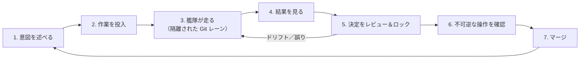

# 標準ワークフロー：依頼からマージまで

> Status: 標準ワークフロー · 対象バージョン 0.1.x

## このページでわかること

これまでのセクションの部品が、1 つの繰り返せるループにどう噛み合うか——典型的な作業が、着想からマージされた結果まで Planetz をどう流れるか。

---

## ループ、ステップごとに

### 1. 意図を述べる

平易な言葉から始めます。[会話モード](../product/conversation.md) で話し合うか、[Spec Studio](../product/spec-studio.md) に **decided intent**——*何が欲しいか、なぜ、何が対象外か*——として直接捉えます。完全な仕様は不要です。意図は進めながら洗練できます。

### 2. 作業を投入する

**Add task** で意図をタスクに変えます。ハーネスに適切な[ワークフロー](../product/workflows.md)へ **自動ルーティング**させるか、自分で選びます。**Enqueue**（キュー投入）するか **Run now**（今すぐ実行）。

### 3. 艦隊が走る

エージェントの一団が並列で実行し、各々が自分の[隔離された Git レーン](../concepts/git-integration.md)にいます。あなたは打ち込むのではなく指揮しており、複数タスクが同時に進行します。

### 4. 結果を見る

[実行ログ](../product/logs-and-summary.md)で実行を追うか、**Tasks** パネルと **Summary** で艦隊全体を眺めます。理解は手元に留まり、*何が、なぜ起きているか*にいつでも答えられます。

### 5. 決定をレビューしロックする

[Decisions](../product/decisions.md) を開きます。エージェントが独断で下した判断が、出自と、あなたの意図を **satisfies（満たす）** か **deviates（逸れる）** かとともに現れ、**Unanchored** がドリフトを示します。**Approve** か **Reject** の裁定を下すと、その裁定は**ロック**され、後の実行が黙って覆せなくなります。

### 6. 不可逆な操作を確認する

取り消せる作業はここまで自由に走ってきました。*再構築可能なゾーンを離れる*わずかな操作——デプロイ・送信・削除——は、自律実行に埋もれるのではなく、意図的な確認（**[Manta](../concepts/edge-ai.md)** による物理的な確認も可）のために段階化されます。

### 7. マージ——そしてループが締まる

結果をマージします。ロックした決定は[意図台帳](../concepts/intent-ledger.md)に残るので、*次の*タスクは、あなたが既に決着させたすべてに照らして確認されます。あなたがエンジニアリングをすることなく、ループは毎回より整合していきます。

## うまくいかないとき

壊れたワークスペースを介抱して直しはしません。意図が保護された資産で、ワークスペースが使い捨てだからこそ、復旧は**意図を戻して再生成**——悪いレーンを捨て、艦隊に作り直させる——です。[Git 連携](../concepts/git-integration.md) を参照。

## 次に読む

- [今後の展望](../roadmap/whats-next.md) — このループが時とともにどう自律化するか。
- [全体像とメンタルモデル](../concepts/overview.md) — 同じループを、概念の側から。
