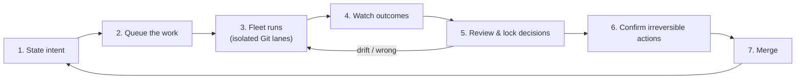

# End-to-end: from request to merge

> Status: The standard workflow · Target version 0.1.x

## What you'll learn

How the pieces from the previous sections come together into one repeatable loop — the way a typical piece of work moves through Planetz from idea to merged result.

---

## The loop, step by step

### 1. State intent

Start in plain language. Talk it through in [Conversation](../product/conversation.md), or capture it directly in [Spec Studio](../product/spec-studio.md) as a **decided intent** — *what you want, why, and what's out of scope*. You don't need a complete spec; intent can be refined as you go.

### 2. Queue the work

Turn the intent into a task with **Add task**. Let the harness **auto-route** it to the right [workflow](../product/workflows.md), or pick one yourself. **Enqueue** it, or **Run now**.

### 3. The fleet runs

A squad of agents executes in parallel, each in its own [isolated Git lane](../concepts/git-integration.md). You're directing, not typing — multiple tasks can be in flight at once.

### 4. Watch outcomes

Follow a run in the [execution log](../product/logs-and-summary.md), or scan the **Tasks** panel and **Summary** for the whole fleet. Comprehension stays with you: you can always answer *what is happening and why*.

### 5. Review and lock decisions

Open [Decisions](../product/decisions.md). Each call an agent made on its own appears with its provenance and whether it **satisfies** or **deviates** from your intent; **Unanchored** flags drift. Give a verdict — **Approve** or **Reject** — and that verdict is **locked** so a future run can't quietly undo it.

### 6. Confirm irreversible actions

Reversible work has been running freely. The few actions that *leave the reconstructible zone* — deploy, send, delete — are staged for a deliberate confirmation (optionally a physical one via **[Manta](../concepts/edge-ai.md)**), not buried inside an autonomous run.

### 7. Merge — and the loop tightens

Merge the result. Your locked decisions stay in the [Intent Ledger](../concepts/intent-ledger.md), so the *next* task is checked against everything you've already settled. The loop gets more aligned each time, without you doing engineering.

## When something goes wrong

You don't nurse a broken workspace back to health. Because intent is the protected asset and the workspace is disposable, recovery is **restore the intent and regenerate** — discard the bad lane and let the fleet rebuild. See [Git integration](../concepts/git-integration.md).

## Next

- [Where Planetz is going](../roadmap/whats-next.md) — how this loop becomes more autonomous over time.
- [Overview & mental model](../concepts/overview.md) — the same loop, from the concepts side.
